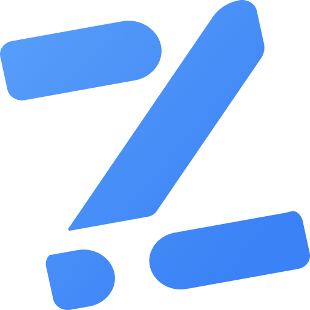

<br />
<div align="center">
  <a href="https://github.com/meragix/zema">
    
  </a>

  <h3 align="center">Zema</h3>

  <p align="center">
    Schema validation for Dart, inspired by <a href="https://zod.dev">Zod</a>.
    <br />
    <em>Define schemas once, parse anywhere. All errors are collected in a single pass.</em>
    <br />
    <a href="https://zema.meragix.dev"><strong>Explore the docs »</strong></a>
    <br />
    <br />
    <a href="https://github.com/meragix/zema/blob/main/CONTRIBUTING.md">Contribute</a>
    &middot;
    <a href="https://github.com/meragix/zema/issues/new">Report Bug</a>
    &middot;
    <a href="https://github.com/meragix/zema/issues/new">Request Feature</a>
  </p>
</div>

## Packages

| Package | Description | CI | Pub |
| ------- | ----------- | -- | --- |
| [zema](https://pub.dev/packages/zema) | Core schema validation library | [](https://github.com/meragix/zema/actions/workflows/zema.yml) | [](https://pub.dev/packages/zema) |
| [zema_forms](https://pub.dev/packages/zema_forms) | Flutter form widgets and controller | [](https://github.com/meragix/zema/actions/workflows/zema_forms.yml) | [](https://pub.dev/packages/zema_forms) |
| [zema_firestore](https://pub.dev/packages/zema_firestore) | Cloud Firestore integration via `withConverter` | [](https://github.com/meragix/zema/actions/workflows/zema_firestore.yml) | [](https://pub.dev/packages/zema_firestore) |
| [zema_hive](https://pub.dev/packages/zema_hive) | Hive local storage integration | [](https://github.com/meragix/zema/actions/workflows/zema_hive.yml) | [](https://pub.dev/packages/zema_hive) |

## Quick Start

```yaml
# pubspec.yaml
dependencies:
  zema: ^0.5.0
```

```dart
import 'package:zema/zema.dart';

final userSchema = z.object({
  'name': z.string().min(2),
  'email': z.string().email(),
  'age': z.integer().gte(18).optional(),
});

// parse() returns the validated value or throws ZemaException
final user = userSchema.parse({
  'name': 'Alice',
  'email': 'alice@example.com',
});

// safeParse() never throws, returns ZemaResult<T>
final result = userSchema.safeParse(rawInput);

switch (result) {
  case ZemaSuccess(:final value):
    print(value['name']);
  case ZemaFailure(:final errors):
    for (final issue in errors) {
      print('${issue.path.join(".")}: ${issue.message}');
    }
}
```

---

## Performance

Schemas defined once at the top level and reused, measured with [`benchmark_harness`](https://pub.dev/packages/benchmark_harness) on an Apple M-series chip, Dart 3.x (JIT). Lower is better.

| Scenario                  | zema          | acanthis | zard     | ez_validator | luthor   |
| ------------------------- | ------------- | -------- | -------- | ------------ | -------- |
| String.email              | **0.81 µs**   | 1.80 µs  | 3.83 µs  | 0.78 µs      | 74.7 µs  |
| Integer.range             | **0.17 µs**   | 0.47 µs  | 2.13 µs  | 0.33 µs      | 0.62 µs  |
| Object.flat (4 fields)    | **4.37 µs**   | 4.34 µs  | 13.4 µs  | 10.1 µs      | 92.8 µs  |
| Object.failure (3 errors) | **12.8 µs**   | 6.27 µs  | 68.0 µs  | 11.3 µs      | 40.2 µs  |

> `Object.failure` measures exhaustive error collection across all fields simultaneously, a core feature of zema. Libraries that short-circuit on the first error will appear faster on this scenario.
>
> Run the benchmarks yourself: `make bench`

---

## Documentation

Full documentation is available at [zema.meragix.dev](https://zema.meragix.dev).

---

## Contributing

Contributions are welcome! See [CONTRIBUTING.md](CONTRIBUTING.md) for guidelines.

---

## License

This project is licensed under the [LICENSE](LICENSE) License
